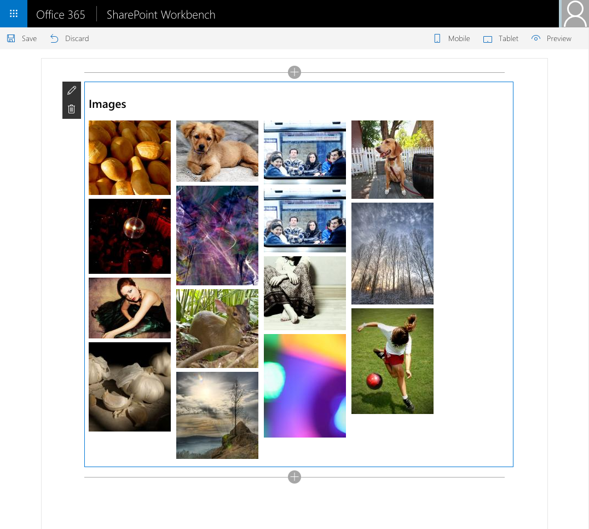

# Using Masonry in SharePoint Framework client-side web parts

Sample web parts showing how to use the [Masonry](http://masonry.desandro.com) library in SharePoint Framework client-side web parts both when using vanilla JavaScript as well as when using jQuery.

## Minimal path to awesome

- clone this repo
- in the command-line run:
  - `npm i`
  - `gulp serve`